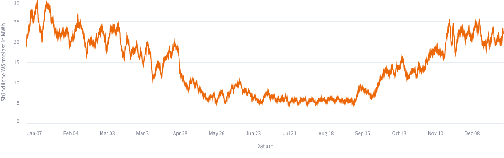
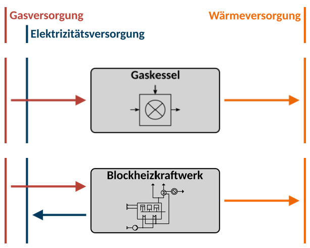
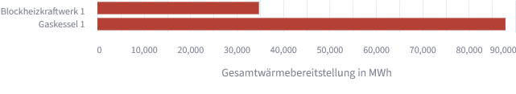
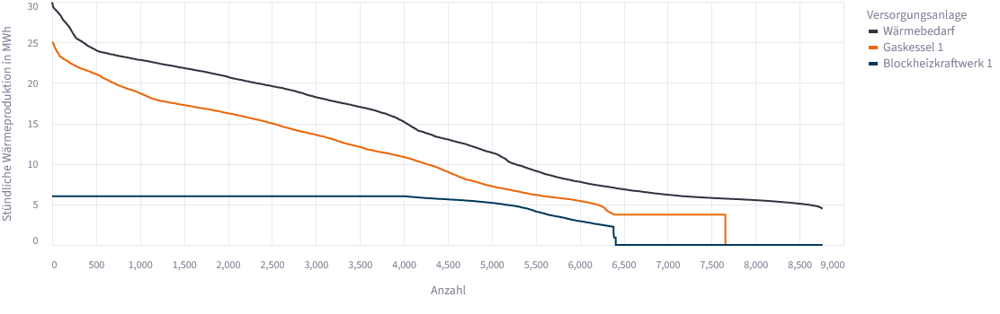
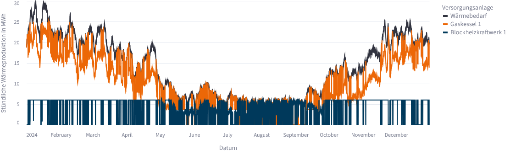
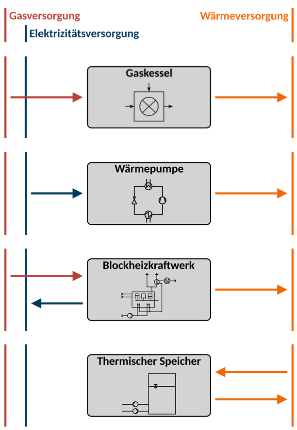
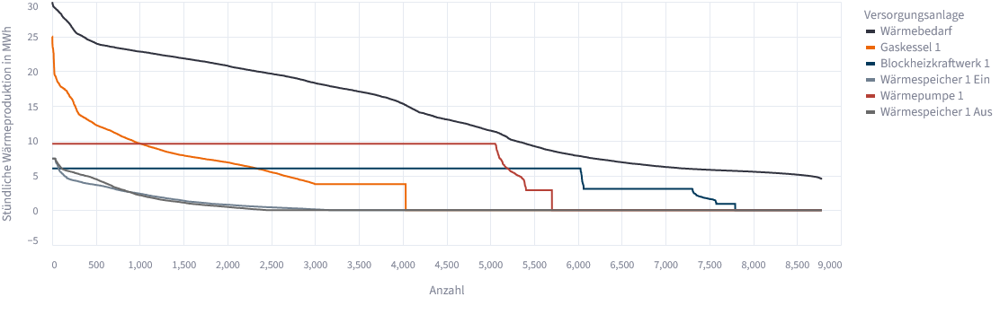
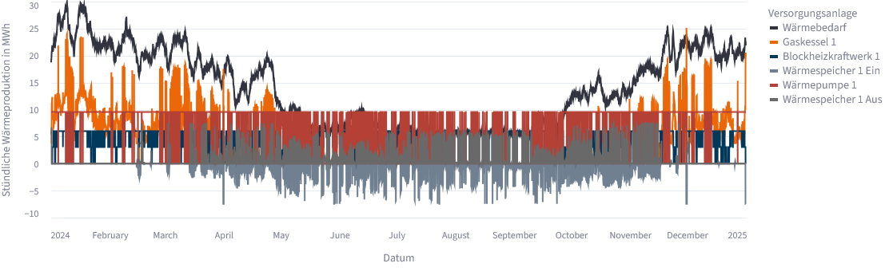
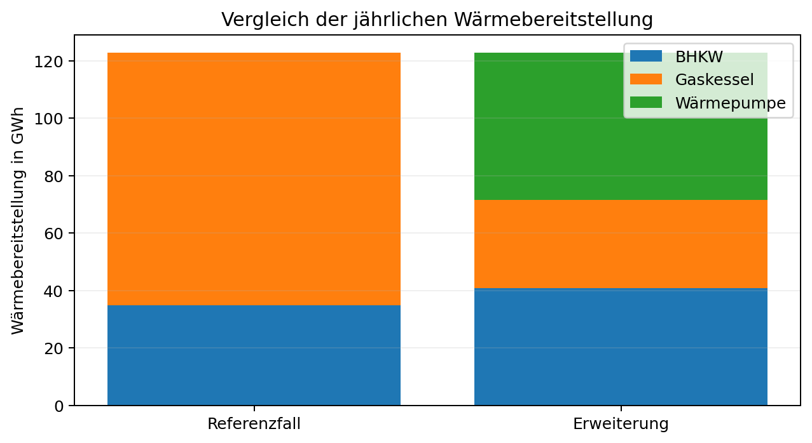

~~~~~~~~~~~~~~~~~~~~
Erstes Energiesystem
~~~~~~~~~~~~~~~~~~~~

In diesem Tutorial wird ein vollständiger Arbeitsablauf im OWP-Tool anhand eines fiktiven kommunalen Fernwärmenetzes durchgeführt. Zunächst wird der Weiterbetrieb des vorhandenen Systems als **Referenzfall** simuliert. Anschließend werden eine Großwärmepumpe und ein thermischer Wärmespeicher ergänzt und durch die Optimierung dimensioniert. Abschließend werden beide Szenarien miteinander verglichen.

Das Tutorial zeigt damit sowohl eine reine Einsatzoptimierung als auch die kombinierte Auslegungs- und Einsatzoptimierung. Eine allgemeine Beschreibung der Bedienoberfläche befindet sich unter :doc:`Toolaufbau`.

Lernziele
=========

Nach Abschluss des Tutorials kann nachvollzogen werden,

* wie ein einfaches Wärmeversorgungssystem im OWP-Tool aufgebaut wird,
* wie bestehende Anlagen mit festen Kapazitäten modelliert werden,
* wie neue Anlagen durch die Optimierung dimensioniert werden,
* wie ein Referenz- und ein Erweiterungsszenario vergleichbar aufgebaut werden und
* wie zentrale technische und wirtschaftliche Ergebnisse eingeordnet werden.

Ausgangssituation
=================

Betrachtet wird ein fiktives Dorf mit rund 5.000 Haushalten und einem bestehenden kommunalen Fernwärmenetz. An das Netz sind vor allem der kompakte Dorfkern sowie mehrere größere gewerbliche und industrielle Verbraucher angeschlossen, darunter eine Molkerei und ein Lebensmittelbetrieb mit Sprühtrocknung. Weiter außerhalb gelegene Höfe und Einzelgebäude werden nicht über das Fernwärmenetz versorgt. Für die Hauptleitungen des Netzes wird eine Trassenlänge von rund 10 km angenommen.

Die Wärmeversorgung basiert bislang auf einem gasbetriebenen BHKW und einem Spitzenlast-Gaskessel. Das BHKW hat 6 MW thermische Nennleistung und stellt bei einem thermischen Wirkungsgrad von 45 % und einem elektrischen Wirkungsgrad von 40 % rund 5,33 MW elektrische Leistung bereit. Zur Deckung höherer Lasten steht zusätzlich ein Gaskessel mit einer installierten thermischen Leistung von 25 MW zur Verfügung.

Die Wärmenachfrage weist durch die angeschlossenen Industriebetriebe eine vergleichsweise hohe Grundlast auf. Auch im Sommer werden rund 5 MW Wärme abgenommen, während die Last in Frühjahr und Herbst typischerweise zwischen 10 und 25 MW und im Winter zwischen 15 und 30 MW liegt.

Im Zuge der Dekarbonisierung soll untersucht werden, ob die Ergänzung des bestehenden Anlagenparks um eine Großwärmepumpe und einen thermischen Wärmespeicher technisch und wirtschaftlich sinnvoll ist und wie beide Komponenten dimensioniert werden sollten.

Die Untersuchung wird in zwei aufeinander aufbauenden Szenarien durchgeführt:

.. list-table:: Untersuchte Szenarien
   :header-rows: 1
   :widths: 20 40 40

   * - Szenario
     - Enthaltene Anlagen
     - Fragestellung
   * - Referenzfall
     - BHKW (6 MW\ :sub:`th`) und Gaskessel (25 MW\ :sub:`th`)
     - Wie wird das bestehende System kostenoptimal betrieben?
   * - Erweiterungsszenario
     - BHKW, Gaskessel, Wärmepumpe und Wärmespeicher
     - Lohnen sich Wärmepumpe und Speicher und welche Kapazitäten werden gewählt?

.. important::

   Die historischen Investitionskosten des bestehenden BHKW, des Gaskessels und des Wärmenetzes werden in beiden Szenarien mit 0 € angesetzt. Sie gelten für die betrachtete Erweiterungsentscheidung als bereits angefallen. Die später ausgewiesenen Wärmegestehungskosten sind deshalb **keine Vollkosten des gesamten realen Wärmesystems**, sondern vorwärtsgerichtete Modellkosten innerhalb der gewählten Systemgrenze.

1. Gemeinsame Eingangsdaten festlegen
=====================================

Beide Szenarien verwenden dieselbe Wärmenachfrage, dasselbe bestehende Wärmenetz sowie dieselben Energiepreise und wirtschaftlichen Randbedingungen. Diese Eingaben werden zunächst für den Referenzfall vorgenommen und im Erweiterungsszenario unverändert beibehalten.

1.1 Wärmenachfrage
------------------

Die Konfiguration beginnt auf der Seite **Energiesystem** im Reiter **Wärme**. Unter **Wähle die Wärmelastdaten aus, die im System zu verwenden sind** wird ``Eigene Daten`` ausgewählt. Anschließend wird über **Datensatz einlesen** die für dieses Tutorial bereitgestellte synthetische Wärmelastzeitreihe eingelesen.

:download:`Wärmelastzeitreihe für das Tutorial herunterladen <../_static/data/waermelast_erstes_energiesystem.csv>`

Die Datei umfasst das vollständige Jahr 2024 in stündlicher Auflösung.

.. list-table:: Wärmenachfrage des Tutorialszenarios
   :header-rows: 1
   :widths: 45 55

   * - Parameter
     - Annahme
   * - Betrachtungszeitraum
     - Jahr 2024, stündliche Auflösung
   * - Jährliche Wärmenachfrage
     - ca. 122,7 GWh\ :sub:`th`
   * - Minimale Wärmelast
     - ca. 4,5 MW\ :sub:`th`
   * - Maximale Wärmelast
     - ca. 30 MW\ :sub:`th`
   * - Wärmeerlös
     - 105 €/MWh\ :sub:`th`

Nach dem Einlesen wird die Zeitreihe im rechten Bereich des Reiters dargestellt. Die angezeigten Kennwerte für Minimum, Maximum und Gesamtlast können zur ersten Plausibilitätskontrolle mit den genannten Größenordnungen verglichen werden.

   Im Tutorial verwendete stündliche Wärmelastzeitreihe.

Unterhalb der Wärmelastdaten wird im Abschnitt **Wärmeerlöse** ein Wärmeerlös von 105 €/MWh eingetragen. Da in beiden Szenarien dieselbe Wärmenachfrage vollständig gedeckt werden muss, ist auch der Wärmeerlös in beiden Fällen gleich. Für den späteren Variantenvergleich ist er daher keine entscheidende Größe, wird aber in der wirtschaftlichen Gesamtbilanz des Tools ausgewiesen.

1.2 Wärmenetz
-------------

Im Reiter **Netz** wird als Kalkulationsmethode ``Spezifische Kosten`` ausgewählt. Für die Trassenlänge werden 10 km eingetragen. Gemeint sind ausschließlich die Hauptleitungen des Fernwärmenetzes; Hausanschlussleitungen werden nicht berücksichtigt.

.. list-table:: Annahmen für das bestehende Wärmenetz
   :header-rows: 1
   :widths: 55 45

   * - Parameter
     - Annahme
   * - Trassenlänge der Hauptleitungen
     - 10 km
   * - Spezifische Investitionskosten Netz
     - 0 €/m
   * - Spezifische fixe Netzkosten
     - 15 €/m·a
   * - Spezifische variable Netzkosten
     - 1,5 €/MWh\ :sub:`th`

Da das Netz bereits vorhanden ist, werden keine Investitionskosten für dessen Errichtung angesetzt. Die laufenden Netzkosten bleiben dagegen Bestandteil der Rechnung. Aus 10 km Trassenlänge und 15 €/m·a ergeben sich fixe Netzkosten von 150.000 € pro Jahr; hinzu kommen 1,5 €/MWh für die transportierte Wärmemenge.

2. Referenzfall: bestehendes System modellieren
===============================================

Im Referenzfall wird geprüft, wie sich das vorhandene System ohne zusätzliche Investitionen verhält. Dazu werden im Reiter **System** unter **Wähle die Wärmeversorgungsanlagen aus, die im System verwendet werden können.** ausschließlich ein **Blockheizkraftwerk** und ein **Gaskessel** ausgewählt. Die Anzahl bleibt jeweils auf ``1`` eingestellt.

   Wärmeversorgungssystem des Referenzfalls.

2.1 Bestandsanlagen parametrisieren
-----------------------------------

Im Reiter **Anlagen** werden die Bereiche **Blockheizkraftwerk 1** und **Gaskessel 1** geöffnet. Bei beiden Anlagen bleibt **Kapazität optimieren** deaktiviert, da die installierten Leistungen des Bestands bereits bekannt sind.

.. list-table:: Parameter der Bestandsanlagen
   :header-rows: 1
   :widths: 48 26 26

   * - Parameter
     - Blockheizkraftwerk
     - Gaskessel
   * - Installierte thermische Leistung
     - 6 MW\ :sub:`th`
     - 25 MW\ :sub:`th`
   * - Thermischer Wirkungsgrad / Wärmeausbeute
     - 45 %
     - 95 %
   * - Elektrischer Wirkungsgrad / Stromausbeute
     - 40 %
     - –
   * - Variable Betriebskosten
     - 11 €/MWh\ :sub:`th`
     - 0,5 €/MWh\ :sub:`th`
   * - Jährliche fixe Betriebskosten
     - 18.000 €/MW\ :sub:`th`·a
     - 1.500 €/MW\ :sub:`th`·a
   * - Investitionskosten
     - 0 €
     - 0 €

Beim BHKW werden unter **Technische Parameter** 6 MW installierte Leistung, 45 % Wärmeausbeute und 40 % Stromausbeute eingetragen. Beim Gaskessel werden 25 MW installierte Leistung und 95 % Wirkungsgrad verwendet. Die Betriebskosten werden jeweils unter **Ökonomische Parameter** hinterlegt. Die Investitionskosten werden auf 0 gesetzt, da beide Anlagen bereits vorhanden sind.

Mit zusammen 31 MW thermischer Leistung kann der bestehende Anlagenpark die maximale Wärmelast von rund 30 MW grundsätzlich vollständig decken. Damit ist sichergestellt, dass die später hinzukommenden Anlagen nicht aus Gründen der Versorgungssicherheit zwingend benötigt werden.

2.2 Versorgungsdaten und weitere Einstellungen
----------------------------------------------

Im Reiter **Versorgung** werden durch BHKW und Gaskessel automatisch die Bereiche **Elektrizitätsversorgungsdaten** und **Gasversorgungsdaten** eingeblendet. Für das Tutorial werden die im Tool hinterlegten zeitabhängigen Daten des Jahres 2024 verwendet; die voreingestellten Werte werden unverändert übernommen.

Im Reiter **Sonstiges** werden ebenfalls die Standardwerte verwendet. Im Bereich **Optimierung** wird ``HiGHS`` als Solver und ein MIP Gap von 2 % verwendet. **Simulationsdauer begrenzen** bleibt deaktiviert.

Weitere Hinweise zu den Solver-Einstellungen befinden sich unter :doc:`/Dokumentation/Solver`.

2.3 Referenzfall optimieren
---------------------------

Nach Abschluss der Parametrisierung wird am unteren Ende des Reiters **Sonstiges** über **Zur Optimierung** zur Seite **Optimierung** gewechselt. Dort wird das System nochmals zusammengefasst. Insbesondere sollte geprüft werden, ob ausschließlich BHKW und Gaskessel enthalten sind und beide Kapazitäten fest vorgegeben wurden.

Mit **Optimierung starten** wird der kostenoptimale Einsatz von BHKW und Gaskessel berechnet. Nach erfolgreichem Abschluss wird zu den **Simulationsergebnissen** gewechselt.

3. Referenzfall auswerten
=========================

Der Referenzfall bildet den Ausgangspunkt für den späteren Vergleich. Im Reiter **Überblick** werden unter anderem die Wärmeproduktion und die wirtschaftlichen Kennzahlen dargestellt. Im Reiter **Anlageneinsatz** kann anschließend der zeitliche Betrieb der Bestandsanlagen nachvollzogen werden.

.. list-table:: Zentrale Ergebnisse des Referenzfalls
   :header-rows: 1
   :widths: 55 45

   * - Kennzahl
     - Referenzfall
   * - Wärmebereitstellung BHKW
     - 34,8 GWh (28,4 %)
   * - Wärmebereitstellung Gaskessel
     - 87,9 GWh (71,6 %)
   * - Gasverbrauch
     - 169,8 GWh
   * - BHKW-Stromerzeugung
     - 30,9 GWh
   * - Stromerlöse
     - 3,21 Mio. €/a
   * - Gaskosten
     - 8,07 Mio. €/a
   * - Wärmegestehungskosten
     - 47,73 €/MWh
   * - Wärmegestehungskosten inkl. Netz
     - 50,46 €/MWh

Rund 71,6 % der Jahreswärme werden im Referenzfall durch den Gaskessel bereitgestellt; das BHKW übernimmt rund 28,4 %. Weil im System noch kein elektrischer Wärmeverbraucher vorhanden ist, wird die gesamte BHKW-Stromproduktion von rund 30,9 GWh in das Stromnetz eingespeist.

   Jährliche Wärmebereitstellung im Referenzfall.

Anlageneinsatz im Referenzfall
------------------------------

Im Reiter **Anlageneinsatz** kann zunächst die geordnete Jahresdauerlinie betrachtet werden. Sie zeigt, für wie viele Stunden bestimmte Leistungen überschritten werden, ohne die zeitliche Reihenfolge des Jahres darzustellen. Das BHKW wird über einen großen Teil des Jahres mit seiner Nennleistung von 6 MW betrieben. Der Gaskessel deckt den verbleibenden Wärmebedarf und übernimmt insbesondere die höheren Lastbereiche.

   Geordnete Jahresdauerlinien des Anlageneinsatzes im Referenzfall.

Die zeitlich aufgelöste Darstellung ergänzt diese Sicht. Hier ist erkennbar, dass der Gaskessel vor allem in den kalten Monaten hohe Leistungen bereitstellt, während das BHKW häufig mit voller Leistung betrieben wird. In Stunden mit niedriger Wärmenachfrage kann das BHKW dagegen teilweise oder vollständig zurückgefahren werden.

   Zeitlich aufgelöster Anlageneinsatz im Referenzfall.

Die Wärmegestehungskosten liegen bei 47,73 €/MWh beziehungsweise 50,46 €/MWh einschließlich der laufenden Netzkosten. Diese Werte dienen im Tutorial vor allem als Referenz für das Erweiterungsszenario. Sie sind nicht als vollständiger Wärmepreis zu verstehen, da die historischen Investitionskosten von Netz, BHKW und Gaskessel nicht berücksichtigt werden.

Bevor das Szenario verändert wird, können die Ergebnisse unten auf der Ergebnisseite über **Bericht herunterladen** gespeichert werden. Über **Daten exportieren** können zusätzlich alle Zahlenwerte für einen späteren Vergleich heruntergeladen werden.

4. Erweiterungsszenario: Wärmepumpe und Speicher ergänzen
=========================================================

Für den zweiten Lauf wird über die Navigation wieder zur Seite **Energiesystem** gewechselt. Die bereits vorgenommenen Eingaben für Wärmenachfrage, Wärmenetz, Bestandsanlagen, Versorgungsdaten und allgemeine wirtschaftliche Parameter bleiben unverändert.

Im Reiter **System** werden nun zusätzlich eine **Wärmepumpe** und ein **Wärmespeicher** ausgewählt. Die Anzahl bleibt auch hier jeweils auf ``1``.

   Wärmeversorgungssystem des Erweiterungsszenarios.

Im Reiter **Anlagen** erscheinen dadurch zusätzlich die Bereiche **Wärmepumpe 1** und **Wärmespeicher 1**. Bei beiden neuen Anlagen wird **Kapazität optimieren** aktiviert. Die Untergrenze von 0 erlaubt es dem Modell ausdrücklich, auf die jeweilige Investition zu verzichten, wenn sie sich unter den gewählten Annahmen nicht lohnt.

4.1 Wärmepumpe parametrisieren
------------------------------

Im Bereich **Wärmepumpe 1** werden unter **Technische Parameter** die minimale und maximale installierbare Leistung sowie der COP festgelegt. Unter **Ökonomische Parameter** werden anschließend die Kosten- und Förderannahmen eingetragen.

.. list-table:: Parameter der Großwärmepumpe
   :header-rows: 1
   :widths: 58 42

   * - Parameter
     - Annahme
   * - Minimale installierbare Leistung
     - 0 MW\ :sub:`th`
   * - Maximale installierbare Leistung
     - 10 MW\ :sub:`th`
   * - COP
     - 3,5
   * - Spezifische Investitionskosten
     - 800.000 €/MW\ :sub:`th`
   * - Investitionskostenförderung
     - 40 %
   * - Variable Betriebskosten
     - 2 €/MWh\ :sub:`th`
   * - Jährliche fixe Betriebskosten
     - 15.000 €/MW\ :sub:`th`·a
   * - Betriebskostenförderung
     - 50 %

Damit wird nicht vorgegeben, dass eine 10-MW-Wärmepumpe errichtet wird. Die Optimierung darf jede Leistung zwischen 0 und 10 MW wählen.

4.2 Wärmespeicher parametrisieren
---------------------------------

Im Bereich **Wärmespeicher 1** wird ebenfalls **Kapazität optimieren** aktiviert. Unter **Technische Parameter** werden die Kapazitätsgrenzen, die möglichen Be- und Entladeleistungen sowie die Speicherverluste festgelegt. Die Kostenannahmen werden unter **Ökonomische Parameter** eingetragen.

.. list-table:: Parameter des Wärmespeichers
   :header-rows: 1
   :widths: 62 38

   * - Parameter
     - Annahme
   * - Minimale Speicherkapazität
     - 0 MWh\ :sub:`th`
   * - Maximale Speicherkapazität
     - 100 MWh\ :sub:`th`
   * - Verhältnis Beladeleistung / Kapazität
     - 0,1 h⁻¹
   * - Verhältnis Entladeleistung / Kapazität
     - 0,1 h⁻¹
   * - Relativer Oberflächenwärmeverlust
     - 0,05 % je Stunde
   * - Initialspeicherstand
     - 50 %
   * - Ausgeglichener Speicherbetrieb
     - ja
   * - Spezifische Investitionskosten
     - 3.000 €/MWh\ :sub:`th`
   * - Investitionskostenförderung
     - 40 %
   * - Variable Betriebskosten
     - 0,2 €/MWh\ :sub:`th`
   * - Jährliche fixe Betriebskosten
     - 300 €/MWh\ :sub:`th`·a

Bei einer Kapazität von 100 MWh würde ein Leistungsverhältnis von 0,1 h⁻¹ beispielsweise eine maximale Lade- und Entladeleistung von jeweils 10 MW erlauben. Der **Initialspeicherstand** wird auf 50 % gesetzt und **Ausgeglichener Speicher über Betrachtungsperiode** bleibt aktiviert. Dadurch muss am Ende des Betrachtungszeitraums wieder derselbe relative Füllstand wie zu Beginn erreicht werden.

Die übrigen bereits gesetzten Werte werden nicht verändert. Anschließend wird erneut über **Zur Optimierung** zur Optimierungsseite gewechselt und die Berechnung mit **Optimierung starten** ausgeführt.

5. Erweiterungsszenario auswerten
=================================

Nach Abschluss der zweiten Optimierung werden zunächst im Reiter **Überblick** die Anlagenkapazitäten betrachtet. Dabei ist zwischen den festen Bestandsleistungen und den durch die Optimierung bestimmten Kapazitäten zu unterscheiden.

.. list-table:: Anlagenkapazitäten im Erweiterungsszenario
   :header-rows: 1
   :widths: 35 25 40

   * - Anlage
     - Kapazität
     - Einordnung
   * - Blockheizkraftwerk
     - 6,0 MW\ :sub:`th`
     - vorgegebene Bestandsleistung
   * - Gaskessel
     - 25,0 MW\ :sub:`th`
     - vorgegebene Bestandsleistung
   * - Wärmepumpe
     - 9,6 MW\ :sub:`th`
     - durch die Optimierung bestimmt
   * - Wärmespeicher
     - 74,4 MWh\ :sub:`th`
     - durch die Optimierung bestimmt

Für die Wärmepumpe werden rund 9,6 MW ermittelt. Damit liegt das Ergebnis nahe an der vorgegebenen Obergrenze von 10 MW. Eine weiterführende Untersuchung sollte deshalb prüfen, ob eine höhere zulässige Maximalleistung zu einer noch größeren optimalen Wärmepumpe führen würde.

Die optimale Speicherkapazität beträgt rund 74,4 MWh. Sie liegt deutlich oberhalb von 0 MWh, aber zugleich unter der Obergrenze von 100 MWh. Der Speicher weist damit innerhalb des zulässigen Bereichs ein eigenes Optimum auf.

5.1 Wärmebereitstellung und Anlageneinsatz
------------------------------------------

.. list-table:: Jährliche Wärmebereitstellung im Erweiterungsszenario
   :header-rows: 1
   :widths: 34 38 28

   * - Erzeuger
     - Jährliche Wärmebereitstellung
     - Anteil am Wärmebedarf
   * - Wärmepumpe
     - 51,3 GWh
     - 41,8 %
   * - Blockheizkraftwerk
     - 40,9 GWh
     - 33,3 %
   * - Gaskessel
     - 30,6 GWh
     - 25,0 %

Die Wärmepumpe übernimmt mit rund 51,3 GWh den größten Anteil der jährlichen Wärmebereitstellung. Auch das BHKW wird stärker eingesetzt als im Referenzfall. Der Gaskessel verliert dagegen deutlich an Bedeutung und übernimmt vor allem Mittel- und Spitzenlast.

Im Reiter **Anlageneinsatz** kann dieses Verhalten zunächst anhand der geordneten Jahresdauerlinie betrachtet werden. Die Wärmepumpe wird in vielen Stunden nahe ihrer optimierten Leistung betrieben. Das BHKW erreicht ebenfalls über weite Teile des Jahres seine Nennleistung. Der Gaskessel wird vor allem in höheren Lastbereichen benötigt.

   Geordnete Jahresdauerlinien des Anlageneinsatzes im Erweiterungsszenario.

In der zeitlich aufgelösten Darstellung wird sichtbar, dass der Gaskessel insbesondere in den kalten Monaten zur Deckung hoher Lasten benötigt wird. In Zeiten niedrigerer Last wird die Versorgung dagegen weitgehend durch Wärmepumpe und BHKW getragen. Der optimale Einsatz hängt dabei nicht nur vom Wärmebedarf, sondern auch von den zeitabhängigen Strom-, Gas- und CO₂-Preisen ab.

   Zeitlicher Verlauf von Wärmebedarf, Anlageneinsatz und Speicherbe- bzw. -entladung im Erweiterungsszenario.

5.2 Stromseite und Speicherbetrieb
----------------------------------

Im Reiter **Stromproduktion** werden Details zu Einspeisung und Eigenverbrauch des Wärmesystems dargestellt. Das BHKW erzeugt im Erweiterungsszenario rund 36,3 GWh Strom. Davon werden etwa 12,4 GWh direkt innerhalb des Systems genutzt und rund 23,9 GWh in das Stromnetz eingespeist.

Die Wärmepumpe benötigt rund 14,7 GWh Strom. Etwa 85 % dieses Bedarfs werden direkt durch das BHKW gedeckt; nur rund 2,2 GWh werden aus dem Netz bezogen. Damit wird die Kopplung von BHKW-Stromerzeugung und Wärmepumpenbetrieb unmittelbar sichtbar.

Im Reiter **Speicherstand** werden Füllstand sowie Be- und Entladung dargestellt. Über das Jahr werden rund 5,72 GWh eingespeichert und 5,65 GWh wieder entnommen. Der Speicher wird damit als Kurzzeit- beziehungsweise Mehrtagesspeicher genutzt und verschiebt Wärme zwischen Stunden mit unterschiedlichen Erzeugungskosten.

6. Referenzfall und Erweiterung vergleichen
===========================================

Für die eigentliche Planungsfrage ist nicht die absolute Wirtschaftlichkeit eines einzelnen Laufs, sondern die Veränderung gegenüber dem Referenzfall entscheidend. Beide Szenarien decken dieselbe Wärmenachfrage und verwenden dasselbe Netz. Unterschiede entstehen daher durch den veränderten Anlagenpark und dessen Einsatz.

   Vergleich der jährlichen Wärmebereitstellung im Referenz- und Erweiterungsszenario.

.. list-table:: Vergleich der wichtigsten Kennzahlen
   :header-rows: 1
   :widths: 30 23 23 24

   * - Kennzahl
     - Referenzfall
     - Erweiterung
     - Veränderung
   * - Gasverbrauch
     - 169,8 GWh
     - 123,0 GWh
     - −46,8 GWh (−27,6 %)
   * - Gaskosten
     - 8,07 Mio. €/a
     - 5,84 Mio. €/a
     - −2,23 Mio. €/a
   * - Stromkosten
     - 0,00 Mio. €/a
     - 0,42 Mio. €/a
     - +0,42 Mio. €/a
   * - Stromerlöse
     - 3,21 Mio. €/a
     - 2,64 Mio. €/a
     - −0,57 Mio. €/a
   * - Investition neue Anlagen
     - 0 €
     - 4,72 Mio. €
     - zusätzliche Investition
   * - LCOH (Erzeugung)
     - 47,73 €/MWh
     - 39,61 €/MWh
     - −8,13 €/MWh (−17,0 %)
   * - LCOH inkl. Netz
     - 50,46 €/MWh
     - 42,33 €/MWh
     - −8,13 €/MWh

6.1 Was erklärt die wirtschaftliche Verbesserung?
-------------------------------------------------

Die Erweiterung reduziert den Gasverbrauch um rund 46,8 GWh beziehungsweise 27,6 %. Dadurch sinken die Gaskosten deutlich. Gleichzeitig entstehen Stromkosten für die Wärmepumpe, und ein größerer Teil des BHKW-Stroms wird intern genutzt, sodass die Stromerlöse gegenüber dem Referenzfall zurückgehen. Der vermiedene Gasbezug überwiegt diese Nachteile im betrachteten Szenario.

Die geförderten Investitionskosten der neuen Anlagen betragen rund 4,72 Mio. €. Bei 5 % Kapitalzins und 20 Jahren Betrachtungsdauer entspricht dies in der LCOH-Berechnung annualisierten Kapitalkosten von rund 379.000 €/a. Nach Berücksichtigung dieser Kapitalkosten sinken die modellierten jährlichen Wärmebereitstellungskosten gegenüber dem Referenzfall um rund 1 Mio. €/a. Dies entspricht der LCOH-Differenz von rund 8,13 €/MWh.

6.2 Wie sind die Wärmegestehungskosten zu verstehen?
----------------------------------------------------

.. important::

   Die LCOH dieses Tutorials sind **keine Vollkosten des gesamten Fernwärmesystems und kein Wärmetarif**. Für Netz, BHKW und Gaskessel wurden die historischen Investitionskosten auf 0 gesetzt. Die Kennzahl beschreibt daher die vorwärtsgerichteten Kosten des betrachteten Bestandssystems einschließlich der annualisierten Investitionskosten der neu hinzukommenden Anlagen.

Gerade deshalb ist hier der Vergleich zwischen den beiden Szenarien aussagekräftiger als der absolute LCOH-Wert. Die Systemgrenze ist in beiden Läufen identisch, sodass sich die nicht berücksichtigten historischen Investitionen nicht auf die Differenz auswirken.

Auch die Netzkosten und die Wärmeerlöse sind in beiden Szenarien gleich. Sie sind für die vollständige wirtschaftliche Bilanz relevant, beeinflussen aber die Entscheidung zwischen Referenz- und Erweiterungsszenario nicht. Entsprechend beträgt die absolute LCOH-Verbesserung mit und ohne Netz in beiden Fällen rund 8,13 €/MWh.

7. Ergebnis einordnen
=====================

Unter den gewählten Annahmen ist die Ergänzung des bestehenden Systems um Wärmepumpe und Wärmespeicher wirtschaftlich vorteilhaft. Das Modell wählt beide Anlagen mit positiver Kapazität und reduziert die modellierten Wärmebereitstellungskosten gegenüber dem Weiterbetrieb des Bestands deutlich. Zugleich sinkt der Gasverbrauch um rund 28 %.

Bei der Interpretation sollten insbesondere folgende Punkte berücksichtigt werden:

* Die Wärmepumpenleistung von rund 9,6 MW liegt nahe an der vorgegebenen Obergrenze von 10 MW. Eine höhere Obergrenze sollte in einer Sensitivitätsanalyse geprüft werden.
* Die wirtschaftliche Vorteilhaftigkeit hängt von Annahmen zu Energiepreisen, COP, Investitionskosten, Förderungen, Betriebskosten und Kapitalzins ab.
* Für eine reale Planung wären zusätzlich unter anderem Wärmequelle und Temperaturniveau der Wärmepumpe, hydraulische und netzseitige Restriktionen, konkrete Investitionsangebote und Genehmigungsfragen zu untersuchen.

Damit wurde ein vollständiger Szenarienvergleich mit dem OWP-Tool durchgeführt: Zunächst wurde ein Referenzfall des vorhandenen Systems aufgebaut und ausgewertet. Anschließend wurde der Anlagenpark erweitert, die neuen Kapazitäten wurden optimiert und die resultierenden Kosten- und Einsatzänderungen wurden gegenüber dem Referenzfall eingeordnet.

Dieses Vorgehen kann für weitere Varianten übernommen werden, indem einzelne technische oder wirtschaftliche Annahmen gezielt verändert und die Ergebnisse erneut mit dem Referenzfall verglichen werden.
