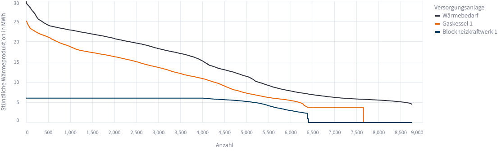
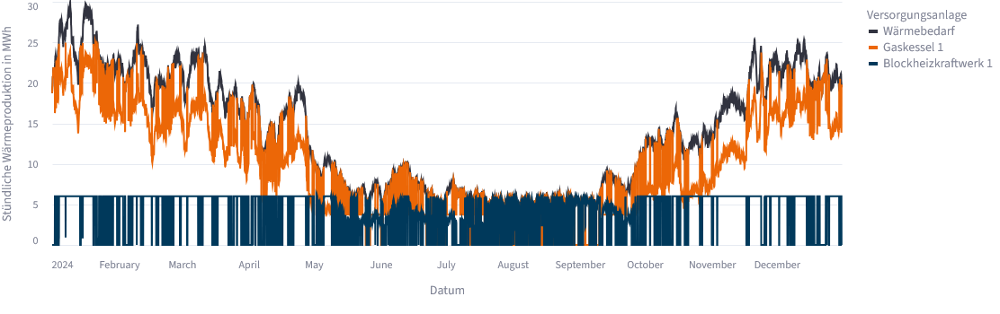
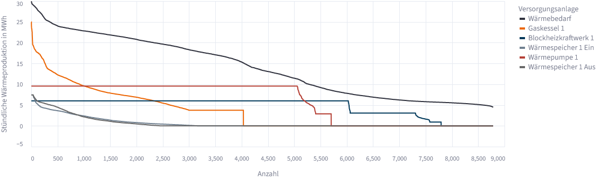
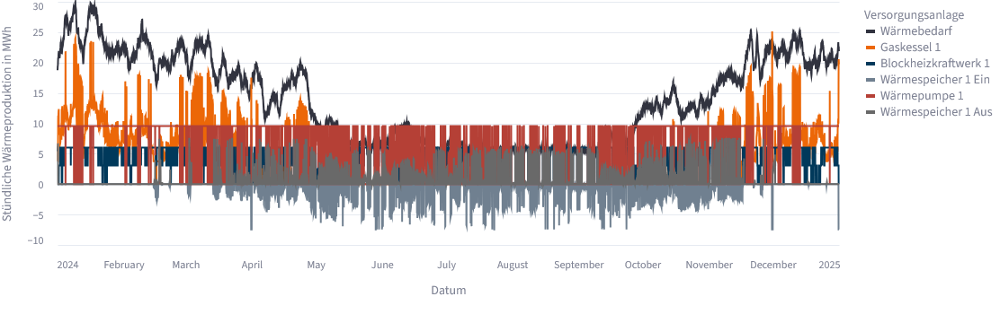

~~~~~~~~~~~~~~~~~~~~~~~~~~~~~~~~~~~~~~~
Anlageneinsatz und Zeitreihen auswerten
~~~~~~~~~~~~~~~~~~~~~~~~~~~~~~~~~~~~~~~

Nach einer erfolgreichen Optimierung zeigt das OWP-Tool nicht nur jährliche Kennzahlen, sondern auch, wann und in welchem Umfang die einzelnen Wärmeversorgungsanlagen eingesetzt werden. Für die Interpretation eines Ergebnisses ist diese zeitliche Perspektive wichtig: Zwei Szenarien können ähnliche Jahresenergiemengen aufweisen und sich trotzdem deutlich darin unterscheiden, welche Anlagen Grund-, Mittel- oder Spitzenlast übernehmen, wie häufig Anlagen ein- und ausgeschaltet werden oder wann ein Wärmespeicher be- und entladen wird.

Dieses How-To zeigt, welche Ergebnisdarstellungen im OWP-Tool für unterschiedliche Fragestellungen geeignet sind, wie Jahresdauerlinien und chronologische Zeitreihen zu lesen sind und wie saisonale Betriebszustände systematisch untersucht werden können. Als Beispiele werden Ergebnisse aus dem Tutorial :doc:`/Erste_Schritte/Erstes_Energiesystem` verwendet.

Welche Ergebnisansicht beantwortet welche Frage?
================================================

Nach der Optimierung wird auf die Seite **Simulationsergebnisse** gewechselt. Abhängig von den im Energiesystem enthaltenen Anlagen stehen dort die Reiter **Überblick**, **Anlageneinsatz**, gegebenenfalls **Stromproduktion**, gegebenenfalls **Speicherstand** und **Erweitert** zur Verfügung.

.. list-table:: Ergebnisansichten im OWP-Tool
   :header-rows: 1
   :widths: 25 34 41

   * - Ansicht
     - Inhalt
     - Typische Fragestellungen
   * - **Überblick**
     - Kapazitäten, Jahresenergiemengen sowie wirtschaftliche und ökologische Kennzahlen
     - Welche Anlagen wurden dimensioniert? Welche Anlage stellt über das Jahr wie viel Wärme bereit? Wie unterscheiden sich Kosten und Emissionen?
   * - **Anlageneinsatz**
     - Geordnete Dauerlinien und chronologischer Wärmebetrieb
     - Welche Anlagen übernehmen Grund-, Mittel- oder Spitzenlast? Wann werden Anlagen eingesetzt? Wie verändert sich der Betrieb zwischen Jahreszeiten?
   * - **Stromproduktion**
     - Netzeinspeisung und interne Nutzung von KWK-Strom
     - Wann wird Strom eingespeist oder intern genutzt? Wie hängt dies mit dem Strompreis zusammen?
   * - **Speicherstand**
     - Speicherfüllstand sowie Be- und Entladung
     - Wann wird Wärme gespeichert und wieder entnommen? Wird der Speicher kurzzeitig oder längerfristig genutzt?
   * - **Erweitert**
     - Solverlog
     - Welche optimierungsspezifischen Informationen wurden vom verwendeten :doc:`Solver </Dokumentation/Solver>` ausgegeben?

Für eine belastbare Ergebnisinterpretation sollten zunächst die Jahreswerte im **Überblick** betrachtet und anschließend auffällige oder besonders relevante Betriebszustände im Reiter **Anlageneinsatz** untersucht werden.

Jahresenergiemengen im Überblick einordnen
==========================================

Im Reiter **Überblick** befindet sich im Abschnitt **Auslegung** neben den installierten beziehungsweise optimierten Kapazitäten auch die jährliche Wärmebereitstellung der Anlagen. Diese Darstellung beantwortet zunächst die Frage, welchen Beitrag die einzelnen Anlagen über den gesamten Betrachtungszeitraum leisten.

Dabei sollten Kapazität und Jahresenergiemenge nicht verwechselt werden. Eine große installierte Leistung kann nur wenige Stunden eingesetzt werden und dadurch eine geringe Jahresenergiemenge bereitstellen. Eine kleinere Anlage kann dagegen durch viele Betriebsstunden einen großen Anteil des Jahreswärmebedarfs decken.

Eine einfache Kennzahl zur gemeinsamen Einordnung von Kapazität und Jahresproduktion sind die äquivalenten Vollbenutzungsstunden:

.. math::

   t_\mathrm{VBH} = \frac{Q_\mathrm{Jahr}}{P_\mathrm{installiert}}

Dabei ist :math:`Q_\mathrm{Jahr}` die jährliche Wärmebereitstellung in MWh und :math:`P_\mathrm{installiert}` die installierte thermische Leistung in MW. Das Ergebnis wird in Stunden angegeben.

Im Erweiterungsszenario des Tutorials :doc:`/Erste_Schritte/Erstes_Energiesystem` stellt die Wärmepumpe beispielsweise rund 51,3 GWh Wärme bei einer optimierten Leistung von rund 9,6 MW bereit. Daraus ergeben sich ungefähr 5.340 äquivalente Vollbenutzungsstunden. Der 25-MW-Gaskessel stellt dagegen nur rund 30,6 GWh bereit und erreicht damit etwa 1.220 äquivalente Vollbenutzungsstunden. Die deutlich größere Nennleistung des Kessels bedeutet somit nicht, dass er die Hauptarbeit des Systems übernimmt.

Sind Wärmespeicher enthalten, werden in der Wärmebereitstellungsübersicht Be- und Entladung separat ausgewiesen. Diese Energiemengen sind als Speicherdurchsatz zu verstehen und nicht als zusätzliche Wärmeerzeugung. Hinweise zur detaillierten Speicherauswertung befinden sich unter :doc:`Waermespeicher`.

Geordnete Jahresdauerlinien lesen
=================================

Im Reiter **Anlageneinsatz** wird zunächst die **Geordnete Jahresdauerlinie des Anlageneinsatzes** dargestellt. Links können unter **Wähle die Wärmeversorgungsanlagen aus** einzelne Zeitreihen ein- oder ausgeblendet werden. Standardmäßig werden alle verfügbaren Wärmezeitreihen einschließlich des Wärmebedarfs dargestellt.

Für die Jahresdauerlinie werden die Werte jeder dargestellten Zeitreihe unabhängig voneinander nach absteigender Größe sortiert. Die zeitliche Reihenfolge des Jahres geht dabei verloren. Links stehen die höchsten Werte, rechts die niedrigsten Werte beziehungsweise Stunden ohne Einsatz.

   Geordnete Jahresdauerlinien im Referenzfall des Tutorials „Erstes Energiesystem“.

Eine Dauerlinie eignet sich besonders für folgende Fragen:

* Wie hoch ist die maximale Wärmelast?
* Über wie viele Zeitschritte treten hohe beziehungsweise niedrige Lasten auf?
* Wird eine Anlage über einen großen Teil des Jahres eingesetzt oder nur in wenigen Spitzenstunden?
* Erreicht eine Anlage häufig ihre installierte Leistung?
* Welche Anlagen übernehmen eher Grund-, Mittel- oder Spitzenlast?

Im dargestellten Referenzfall wird das BHKW über viele Stunden mit hoher Leistung eingesetzt, während der Gaskessel den verbleibenden Bedarf und insbesondere hohe Lastbereiche übernimmt. Der Gaskessel weist zwar eine deutlich höhere installierte Leistung auf, wird aber nicht über das gesamte Jahr auf diesem Niveau benötigt.

.. important::

   Die Zeitreihen werden für die Dauerlinie **jeweils separat sortiert**. Ein Punkt an derselben x-Position gehört daher nicht zwingend zur selben Stunde. Die Leistungen verschiedener Anlagen dürfen in der geordneten Dauerlinie nicht zeilenweise addiert werden, um die Wärmebilanz einer bestimmten Stunde zu prüfen. Für die Untersuchung des gleichzeitigen Anlagenbetriebs muss die chronologische Darstellung **Tatsächlicher Anlageneinsatz** verwendet werden.

Wird ein Wärmespeicher dargestellt, erscheint die Speicherbeladung in der geordneten Dauerlinie als positive Größe. Erst in der chronologischen Darstellung wird die Beladung zur besseren Unterscheidung negativ dargestellt.

Grund-, Mittel- und Spitzenlast einordnen
-----------------------------------------

Die Begriffe Grund-, Mittel- und Spitzenlast beschreiben in diesem Zusammenhang keine fest im OWP-Tool hinterlegten Anlagenklassen, sondern ergeben sich aus dem optimierten Einsatz.

Eine Anlage, die über sehr viele Zeitschritte mit relativ hoher Leistung betrieben wird, übernimmt typischerweise einen großen Anteil der Grundlast. Anlagen, die nur bei höheren Wärmelasten oder in wenigen Stunden eingesetzt werden, übernehmen eher Mittel- oder Spitzenlast.

Die Jahresdauerlinie unterstützt diese Einordnung, ersetzt aber nicht die chronologische Analyse. Beispielsweise lässt sich aus ihr nicht erkennen, ob Spitzenlaststunden im Januar, im November oder aufgrund eines einzelnen ungewöhnlichen Zeitraums auftreten.

Tatsächlichen Anlageneinsatz untersuchen
========================================

Unterhalb der Dauerlinie wird im Reiter **Anlageneinsatz** der **Tatsächliche Anlageneinsatz** dargestellt. Ohne Aggregation werden die Werte in ihrer zeitlichen Reihenfolge als Linien dargestellt. Dadurch kann nachvollzogen werden, welche Anlagen zu einem bestimmten Zeitpunkt gleichzeitig betrieben werden.

   Tatsächlicher Anlageneinsatz im Referenzfall des Tutorials „Erstes Energiesystem“.

Bei der standardmäßig verwendeten stündlichen Zeitauflösung werden die Wärmeflüsse im Tool als Energiemengen pro Zeitschritt in MWh dargestellt. Da ein Zeitschritt eine Stunde umfasst, entspricht ein Wert von beispielsweise 6 MWh in einer Stunde numerisch einer mittleren thermischen Leistung von 6 MW während dieser Stunde.

In der chronologischen Darstellung können unter anderem folgende Fragen untersucht werden:

* Wann werden einzelne Anlagen ein- oder ausgeschaltet?
* Welche Anlagen laufen gleichzeitig?
* Welche Anlage reagiert auf hohe Wärmelasten?
* Wie verändert sich der Einsatz zwischen Winter, Sommer und Übergangszeit?
* Wann wird ein Wärmespeicher be- oder entladen?
* Treten ungewöhnlich häufige Lastwechsel oder längere Stillstandszeiten auf?

Sind Wärmespeicher enthalten, wird die **Beladung negativ** und die **Entladung positiv** dargestellt. Dadurch lässt sich die Wärmebilanz anschaulich lesen: Wärmeerzeugung und Speicherentladung decken den Wärmebedarf sowie gegebenenfalls die gleichzeitig in den Speicher eingespeicherte Wärme.

Zeitraum gezielt auswählen
==========================

Über **Zeitraum auswählen** kann im Reiter **Anlageneinsatz** ein beliebiger Ausschnitt des Betrachtungszeitraums ausgewählt werden. Für die Analyse eines gesamten Jahres ist die vollständige Ansicht hilfreich, für konkrete Betriebsfragen sollte jedoch meist ein kürzerer Zeitraum betrachtet werden.

Für eine saisonale Analyse bietet sich beispielsweise folgende Vorgehensweise an:

.. list-table:: Beispiel für eine saisonale Ergebnisanalyse
   :header-rows: 1
   :widths: 24 36 40

   * - Zeitraum
     - Schwerpunkt
     - Zu untersuchende Fragen
   * - Winter
     - Hohe Wärmenachfrage und Spitzenlast
     - Welche Anlagen erreichen hohe Leistungen? Werden zusätzliche Spitzenlasterzeuger benötigt? Wie häufig werden Kapazitätsgrenzen erreicht?
   * - Sommer
     - Niedrige Wärmenachfrage und Grundlast
     - Welche Anlagen bleiben in Betrieb? Treten häufige Ein-/Ausschaltvorgänge auf bzw. sind diese realistisch? Wird überschüssige oder günstige Wärme gespeichert?
   * - Frühjahr und Herbst
     - Wechselnde Lasten
     - Wie reagiert das System auf schwankende Nachfrage? Welche Anlagen übernehmen die flexible Mittel- und Spitzenlast?

Eine solche Betrachtung ist insbesondere dann sinnvoll, wenn die Jahresdarstellung sehr überladen ist und einzelne Betriebszustände nicht mehr erkennbar sind.

Ergebnisse aggregieren
======================

Mit **Ergebnisse aggregieren** können die Zeitreihen im Reiter **Anlageneinsatz** zusammengefasst werden. Zur Auswahl stehen derzeit ``Stündlich``, ``Täglich``, ``Wöchentlich``, ``Monatlich`` und ``Quartalsweise``. Zusätzlich kann zwischen den Aggregationsmethoden ``Mittelwert`` und ``Summe`` gewählt werden.

.. list-table:: Aggregationsmethoden
   :header-rows: 1
   :widths: 25 35 40

   * - Methode
     - Bedeutung
     - Geeignet für
   * - **Mittelwert**
     - Mittelwert der ursprünglichen stündlichen Ergebniswerte innerhalb des gewählten Zeitraums
     - Vergleich des typischen Betriebsniveaus zwischen Tagen, Wochen oder Monaten
   * - **Summe**
     - Summe der stündlichen Energiemengen innerhalb des gewählten Zeitraums
     - Vergleich der insgesamt bereitgestellten Wärmeenergie zwischen Tagen, Wochen oder Monaten

Bei aktivierter Aggregation wird die chronologische Darstellung als Balkendiagramm ausgegeben. Bei ``Summe`` entspricht ein Monatsbalken beispielsweise der gesamten in diesem Monat bereitgestellten Wärmeenergie einer Anlage. Dieser Wert darf nicht mit der installierten Anlagenleistung verglichen werden. Für die Beurteilung von Leistungsspitzen sollte daher die stündliche Darstellung oder gegebenenfalls der Mittelwert verwendet werden.

Die geordnete Dauerlinie wird ebenfalls aus den gewählten und gegebenenfalls aggregierten Daten erzeugt. Bei täglicher, wöchentlicher oder monatlicher Aggregation repräsentiert die x-Achse deshalb die Anzahl der sortierten **Aggregationszeiträume** und nicht mehr einzelne Stunden, auch wenn die Darstellung weiterhin als Jahresdauerlinie bezeichnet wird.

.. note::

   Im aktuellen Tool wird der Wärmebedarf bei aktivierter Aggregation in der chronologischen Darstellung **Tatsächlicher Anlageneinsatz** nicht mitgezeichnet. In der geordneten Dauerlinie kann er weiterhin ausgewählt und dargestellt werden. Für einen direkten zeitlichen Vergleich von Erzeugung und Wärmebedarf sollte die Aggregation daher deaktiviert werden.

Teillast und Ein-/Ausschaltvorgänge richtig interpretieren
==========================================================

Mehrere Wärmeerzeuger werden im aktuellen OWP-Modell mit einer binären Ein-/Aus-Entscheidung und einer relativen Mindestwärmeleistung abgebildet. Dadurch können in der Zeitreihe Sprünge zwischen Stillstand und einem Mindestbetriebsniveau sichtbar werden.

In den derzeitigen Modellparametern beträgt die relative Mindestwärmeleistung standardmäßig 30 % bei Wärmepumpen und 15 % bei BHKW, Gas- und Dampfkraftwerken, Gaskesseln und Elektrodenheizkesseln. Diese relativen Mindestleistungen werden im aktuellen Stand nicht als Eingabefelder auf der Benutzeroberfläche angeboten.

.. important::

   Häufige Ein-/Ausschaltvorgänge können in der Zeitreihe erkannt werden, ihre realen technischen und wirtschaftlichen Folgen werden im aktuellen Modell jedoch nur eingeschränkt abgebildet. Die verwendeten Wirkungsgrade beziehungsweise der COP sind innerhalb eines Szenarios konstant; außerdem werden derzeit keine nutzerdefinierten Anfahrkosten, Mindestlaufzeiten, Mindeststillstandszeiten oder Rampenbegrenzungen parametrisiert. Aus häufigem Takten kann daher nicht unmittelbar auf zusätzlichen Brennstoffverbrauch, Verschleiß oder reale Betriebsfähigkeit geschlossen werden.

Die Zeitreihe eignet sich somit gut, um potenziell auffällige Betriebsweisen zu identifizieren. Soll die technische Umsetzbarkeit eines detaillierten Fahrplans bewertet werden, sind zusätzliche anlagenspezifische Untersuchungen erforderlich.

Beispiel: Referenzfall aus dem Tutorial
=======================================

Im Referenzfall des Tutorials :doc:`/Erste_Schritte/Erstes_Energiesystem` stehen ein BHKW mit 6 MW thermischer Leistung und ein Gaskessel mit 25 MW zur Verfügung. Über das Jahr stellt das BHKW rund 34,8 GWh Wärme und der Gaskessel rund 87,9 GWh bereit.

Die Jahresdauerlinie zeigt, dass das BHKW über einen großen Teil des Jahres eingesetzt wird und häufig nahe seiner installierten Leistung arbeitet. Der Gaskessel folgt stärker dem verbleibenden Wärmebedarf und deckt insbesondere hohe Lasten.

Die chronologische Zeitreihe ergänzt diese Information: Im Winter übernimmt der Gaskessel einen großen Anteil der Wärmeversorgung, während das BHKW parallel häufig mit hoher Leistung betrieben wird. Im Sommer sinkt der Wärmebedarf deutlich. Dort wird sichtbar, dass das BHKW aufgrund der niedrigeren Last häufiger reduziert oder abgeschaltet wird.

Aus der Kombination beider Diagramme lässt sich damit eine belastbarere Aussage ableiten als aus einem einzelnen Jahreswert: Das BHKW besitzt im Referenzfall eine grundlastnahe Rolle, während der größere Gaskessel flexibel die verbleibende Nachfrage und hohe Lastbereiche deckt.

Beispiel: Erweiterungsszenario vergleichen
==========================================

Im Erweiterungsszenario des gleichen Tutorials kommen eine optimierte Wärmepumpe und ein Wärmespeicher hinzu. Die jährliche Wärmebereitstellung verändert sich dadurch deutlich: Die Wärmepumpe stellt rund 51,3 GWh, das BHKW rund 40,9 GWh und der Gaskessel nur noch rund 30,6 GWh bereit.

   Geordnete Jahresdauerlinien im Erweiterungsszenario.

Die Dauerlinie zeigt, dass Wärmepumpe und BHKW über viele Stunden hohe Auslastungen erreichen, während der Gaskessel deutlich stärker in die Mittel- und Spitzenlast gedrängt wird als zuvor.

   Tatsächlicher Anlageneinsatz im Erweiterungsszenario.

Erst die chronologische Darstellung zeigt zusätzlich, **wann** diese Verschiebung stattfindet und wie der Wärmespeicher dabei Wärme zwischen verschiedenen Stunden verschiebt. Dadurch kann nachvollzogen werden, ob eine Veränderung der Jahresenergiemengen durch einen dauerhaft anderen Betrieb oder nur durch wenige besondere Zeiträume verursacht wird.

Stromproduktion bei KWK-Anlagen ergänzend untersuchen
=====================================================

Ist mindestens ein BHKW oder Gas- und Dampfkraftwerk enthalten, steht zusätzlich der Reiter **Stromproduktion** zur Verfügung. Dort werden die ins Netz eingespeiste Elektrizität, die intern genutzte Elektrizität und die Spotmarktpreiszeitreihe dargestellt.

Auch hier kann über **Zeitraum auswählen** ein Teilzeitraum gewählt und über **Ergebnisse aggregieren** eine stündliche, tägliche, wöchentliche, monatliche oder quartalsweise Darstellung erzeugt werden.

Für Energieflüsse ist bei einer Aggregation die Methode ``Summe`` geeignet, wenn die gesamte Strommenge eines Zeitraums betrachtet werden soll. Für die Spotmarktpreiszeitreihe ist dagegen der ``Mittelwert`` in der Regel besser interpretierbar als die Summe von Stundenpreisen.

.. note::

   Die Kennzahlen **Stromerlöse**, **Stromkosten**, **Stromkosten (Netz)** und **Stromkosten (intern)** im Reiter **Stromproduktion** werden im aktuellen Tool für den gesamten Optimierungszeitraum berechnet. Eine Einschränkung über **Zeitraum auswählen** verändert dagegen die dargestellten Zeitreihen und nur die beiden Mengenkennzahlen **Stromproduktion in MWh (Spotmarkt)** und **Stromproduktion in MWh (intern)**. Bei der Analyse eines Teilzeitraums sollten diese beiden Arten von Kennzahlen daher nicht miteinander verwechselt werden.

Im Erweiterungsszenario des Tutorials wird ein großer Teil des BHKW-Stroms intern von der Wärmepumpe genutzt. Durch den gemeinsamen Blick auf Wärme- und Stromseite lässt sich erklären, warum sich der BHKW-Einsatz gegenüber dem Referenzfall verändert.

Ergebnisdaten für weiterführende Analysen exportieren
=====================================================

Für Auswertungen, die über die eingebauten Diagramme hinausgehen, können die vollständigen Ergebnisdaten im Reiter **Überblick** über **Daten exportieren** gespeichert werden. Das ZIP-Archiv enthält unter anderem die Datei ``Ergebnisse_Zeitreihen.csv`` mit den Zeitreihen des optimierten Systems.

Verfügbare Spalten sind beispielsweise:

.. list-table:: Beispiele aus den exportierten Zeitreihen
   :header-rows: 1
   :widths: 35 65

   * - Spalte
     - Bedeutung
   * - ``Q_demand``
     - Wärmenachfrage je Zeitschritt
   * - ``Q_ice1``
     - Wärmebereitstellung des ersten BHKW
   * - ``Q_gb1``
     - Wärmebereitstellung des ersten Gaskessels
   * - ``Q_out_hp1``
     - Wärmebereitstellung der ersten Wärmepumpe
   * - ``Q_in_tes1`` / ``Q_out_tes1``
     - Be- beziehungsweise Entladung des ersten Wärmespeichers
   * - ``P_spotmarket``
     - ins Stromnetz vermarktete KWK-Strommenge
   * - ``P_internal``
     - innerhalb des modellierten Systems genutzter KWK-Strom
   * - ``P_source``
     - Strombezug aus dem Netz
   * - ``H_source``
     - Gasbezug

Die konkreten Spalten hängen vom jeweils modellierten Anlagenpark ab. Für weiterführende Auswertungen sollte deshalb nicht vorausgesetzt werden, dass jede genannte Spalte in jedem Ergebnisdatensatz vorhanden ist.

Typische Fehlinterpretationen
=============================

**„Die Jahresdauerlinie zeigt den Jahresverlauf.“**
   Die zeitliche Reihenfolge wird in der Jahresdauerlinie vollständig aufgehoben. Für saisonale oder zeitlich gekoppelte Aussagen muss die chronologische Darstellung verwendet werden.

**„Die Kurven der Jahresdauerlinie können an jeder x-Position addiert werden.“**
   Jede Zeitreihe wird unabhängig von den anderen sortiert. Gleiche x-Positionen entsprechen daher nicht derselben Stunde.

**„Eine Anlage mit der größten installierten Leistung liefert automatisch den größten Teil der Jahreswärme.“**
   Die Jahreswärme hängt sowohl von der Leistung als auch von der Einsatzdauer und dem Teillastbetrieb ab. Kapazität und Jahresenergie sollten immer gemeinsam betrachtet werden.

**„Eine hohe Zahl an Schaltvorgängen beweist, dass das reale System ineffizient wäre.“**
   Das Tool kann auffälliges Takten sichtbar machen, bildet derzeit jedoch keine lastabhängigen Wirkungsgrade, Anfahrkosten, Mindestlaufzeiten oder Rampenrestriktionen als nutzerdefinierte Betriebsparameter ab. Auch wenn häufiges Takten in der Regel nicht ökonomisch sinnvoll ist, muss die reale technische Wirkung daher separat bewertet werden.

Kurzcheck für die Auswertung des Anlageneinsatzes
=================================================

Vor einer abschließenden Interpretation sollte geprüft werden:

* Welche Anlagen übernehmen Grund-, Mittel- und Spitzenlast?
* Liegen Anlagen häufig an ihrer maximalen Leistung oder bleiben große Kapazitätsreserven ungenutzt?
* Was zeigt die chronologische Zeitreihe in Winter, Sommer und Übergangszeit?
* Gibt es auffällige Ein-/Ausschaltmuster?
* Wird bei aggregierten Ergebnissen richtig zwischen Mittelwert und Summe unterschieden?
* Werden Dauerlinie und chronologische Zeitreihe entsprechend ihrer unterschiedlichen Aussagekraft verwendet?
* Werden bei KWK-Systemen Wärme- und Stromseite gemeinsam betrachtet?
* Sind auffällige Ergebnisse technisch erklärbar? Sollte eine :doc:`Sensitivitätsanalyse <Optimierungsgrenzen_Sensitivitaeten>` durchgeführt werden?

Eine Kombination aus Jahreskennzahlen, Dauerlinie und chronologischer Zeitreihe hilft dabei, die Lösung, die das Optimierungsmodell gefunden hat, und deren Betrieb über den Betrachtungszeitraum besser zu verstehen.